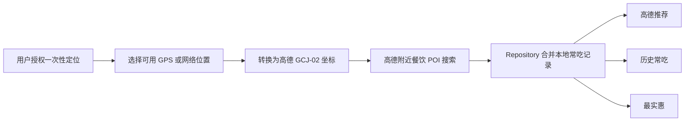

# DeliciousFoodSearch（周末吃什么）

一款面向情侣和小伙伴的 Android 附近美食发现应用：获取用户授权的位置后，通过高德搜索附近真实餐厅，并从“高德推荐、历史常吃、最实惠”三个角度帮助用户更快决定今天吃什么。

> [!IMPORTANT]
> 项目仍在开发中。附近餐厅来自高德开放平台；美团、抖音仅提供按店名跳转搜索，不读取或伪造其团购价格。运行真实数据前，需要使用你自己的高德 Android Key。

## 你能用它做什么

- 获取设备当前的一次性位置，搜索 5 公里内的真实餐饮 POI。
- 在“高德推荐”“历史常吃”“最实惠”三个首页栏目中浏览餐厅。
- 按价格、味道或距离继续排序：
  - 高德推荐：保留高德搜索结果的综合权重顺序，该权重不是公开数值评分。
  - 味道：按高德返回的商家评分从高到低排列。
  - 最实惠：按参考人均价格从低到高排列，未知价格放在最后。
  - 距离：按当前位置到商家的距离从近到远排列。
- 点击“更新餐厅”重新获取营业信息、评分、参考人均价和距离，并查看最后更新时间。
- 将喜欢的餐厅记为“吃过”，在本机形成历史常吃排序。
- 按店名跳转美团或抖音，由用户在对应平台核实当前团购。
- 定位不可用时，明确选择“北京市中心”作为搜索区域，不把演示位置伪装成真实位置。

## 当前完成度

| 能力 | 状态 | 说明 |
| --- | --- | --- |
| 高德附近餐厅 | 已实现 | 搜索当前位置 5 公里内的餐饮 POI |
| 高德推荐 / 历史常吃 / 最实惠 | 已实现 | 首页三个独立入口 |
| 价格 / 味道 / 距离排序 | 已实现 | 缺失数据不会被伪造成精确数值 |
| 主动刷新和状态反馈 | 已实现 | 包含加载、失败、重试和最后更新时间 |
| 本地常吃记录 | 已实现 | 仅保存在当前设备 |
| 美团 / 抖音团购 | 部分实现 | 当前为合规跳转搜索，不读取团购详情 |
| 2 至 6 人套餐推荐 | 规划中 | 等待合法、可靠的套餐人数数据源 |
| 双人通信与餐厅分享 | 规划中 | 尚未实现账号、配对和消息服务 |

## 技术栈与运行环境

| 项目 | 当前配置 |
| --- | --- |
| 开发语言 | Kotlin 2.2.10 |
| UI | Jetpack Compose + Material 3 |
| 架构 | 单 Activity、ViewModel、Repository、数据源适配层 |
| 异步 | Kotlin Coroutines / Flow |
| 餐厅数据 | 高德搜索 SDK 9.7.1 |
| 构建系统 | Gradle 9.4.1 + Android Gradle Plugin 9.2.1 |
| Java | JDK 17 |
| Android SDK | compileSdk / targetSdk 37 |
| 最低系统 | Android 8.0（API 26） |

推荐使用支持 AGP 9.2 的 Android Studio Panda 4（2025.3.4）或更新版本，并在 SDK Manager 中安装 Android SDK Platform 37。项目不要求 NDK。

## 快速开始

### 1. 克隆代码

```bash
git clone https://github.com/01z-hub/DeliciousFoodSearch.git
cd DeliciousFoodSearch
```

### 2. 用 Android Studio 打开

1. 启动 Android Studio，选择 **Open**。
2. 选择克隆后的 `DeliciousFoodSearch` 目录。
3. 等待 Gradle Sync 和依赖下载完成。
4. 确认 **Gradle JDK** 使用 JDK 17。

也可以先在终端检查 Java：

```bash
java -version
```

### 3. 申请并配置高德 Key

1. 登录[高德开放平台控制台](https://console.amap.com/dev/key/app)，创建应用并添加 **Android 平台 Key**。
2. 在项目根目录运行签名报告：

   ```bash
   ./gradlew signingReport
   ```

   Windows PowerShell 使用：

   ```powershell
   .\gradlew.bat signingReport
   ```

3. 在高德控制台填写：
   - Package Name：`com.zyb.deliciousfoodsearch`
   - SHA1：`signingReport` 中当前 Debug 签名的 SHA1
4. 复制示例配置：

   ```bash
   cp local.properties.example local.properties
   ```

5. 打开 `local.properties`，写入你自己的 Key：

   ```properties
   AMAP_API_KEY=your_android_amap_key
   ```

`local.properties` 已加入 Git 忽略规则。请勿把真实 Key 写入 README、源码、Issue、日志或提交记录。发布 APK 时，需要在高德控制台额外配置发布签名的 SHA1。

更完整的申请说明见[高德 Android Key 官方文档](https://lbs.amap.com/api/android-location-sdk/guide/create-project/get-key/)。

### 4. 运行应用

1. 连接 Android 8.0 或更高版本的真机，或启动带 Google APIs 的模拟器。
2. 打开设备定位服务；真机建议同时开启“精确位置”和 Wi-Fi 扫描。
3. 在 Android Studio 顶部选择 `app`，点击 **Run**。
4. 首次启动时阅读隐私说明，并按需授权位置权限。

没有可用位置时，可以在页面中选择“北京市中心”验证高德餐厅搜索链路。

## 命令行构建与验证

macOS / Linux：

```bash
./gradlew testDebugUnitTest lintDebug assembleDebug
```

Windows：

```powershell
.\gradlew.bat testDebugUnitTest lintDebug assembleDebug
```

构建成功后，Debug APK 位于：

```text
app/build/outputs/apk/debug/app-debug.apk
```

如已配置 ADB，也可以安装到已连接设备：

```bash
adb install -r app/build/outputs/apk/debug/app-debug.apk
```

仓库目前没有提供可直接下载的 GitHub Release APK，因此首次使用者需要克隆并自行构建。

## 项目结构

```text
app/src/main/java/com/zyb/deliciousfoodsearch/
├── MainActivity.kt                 # 权限、隐私同意与应用入口
├── data/
│   ├── AmapFoodDataSource.kt       # 高德 POI 数据适配
│   ├── FoodDiscoveryRepository.kt  # 数据访问入口
│   └── RestaurantHistoryStore.kt   # 本地常吃记录
├── domain/
│   ├── FoodModels.kt               # 餐厅与页面领域模型
│   ├── RestaurantSectionSelector.kt# 三个首页栏目的选择规则
│   └── RestaurantSorter.kt         # 价格、味道、距离排序
├── location/
│   ├── SystemSingleLocationProvider.kt # 系统单次定位
│   ├── LocationFixSelector.kt      # GPS / 网络位置择优
│   └── Gcj02CoordinateConverter.kt # WGS84 到 GCJ-02 转换
└── ui/
    ├── FoodDiscoveryViewModel.kt   # 页面状态与刷新任务
    └── FoodDiscoveryScreen.kt      # Compose 首页
```

核心数据流：



## 数据、定位与隐私边界

- 高德 SDK 提供餐厅 POI、分类、评分、参考人均价、地址和营业时间等字段，但不提供美团或抖音的团购套餐价格。
- “实时更新”指用户点击刷新后，获取数据源当时可提供的最新信息，不代表秒级推送。
- 应用只请求前台粗略位置和精确位置，不申请后台持续定位。
- 精确坐标不写入历史记录或日志；“吃过”记录仅保存在当前设备。
- 应用不会绕过登录、验证码、签名或反爬机制抓取第三方平台。
- 高德综合权重只用于保持搜索结果顺序，不展示不存在的 weight 数值。

## 常见问题

### 授权定位后仍然没有附近餐厅

依次检查：

1. 手机系统定位是否开启，应用是否取得位置权限。
2. 高德 Key 绑定的 Package Name 是否为 `com.zyb.deliciousfoodsearch`。
3. 高德 Key 的 Debug SHA1 是否与 `./gradlew signingReport` 输出一致。
4. 当前网络是否可以访问高德服务。
5. 修改 Key 后是否重新构建并安装了 APK。

### 模拟器只能使用北京位置

模拟器通常没有真实 GPS 信号。请在 Emulator 的 **Extended controls > Location** 中发送一个模拟坐标，或使用真机测试。页面中的“北京市中心”是明确的手动降级入口，不代表真实定位成功。

### Gradle Sync 或依赖下载失败

确认 Android Studio 未启用 Gradle Offline Mode，并检查当前网络能否访问 Google Maven、Maven Central 和 Gradle 分发服务。首次构建需要下载依赖。

### 如何拉取后续更新

在没有本地修改时运行：

```bash
git switch main
git pull --ff-only origin main
```

如果已有本地修改，请先提交或暂存自己的工作，避免覆盖。

## 后续计划

- 在取得合法数据接口或合作授权后，展示真实团购套餐、价格和适用人数。
- 完成 2、3、4、5、6 人用餐推荐规则。
- 实现双人账号配对、文字通信与餐厅卡片分享。
- 增加不同屏幕尺寸、深色模式和 UI 自动化验证。
- 提供经过隐私检查的应用截图和可下载 Release APK。

## 参与开发

1. 开始工作前完整阅读 [`AGENTS.md`](AGENTS.md)。
2. 从最新目标分支创建短生命周期分支。
3. 只提交与本次任务有关的文件，不提交 Key、签名文件、构建产物或 IDE 私有状态。
4. 修改完成后至少运行：

   ```bash
   ./gradlew testDebugUnitTest lintDebug assembleDebug
   ```

5. 提交信息应说明修改意图，并在 Pull Request 中写明验证结果和仍未验证的风险。

## 参考项目与文档

README 的信息结构参考了 [Now in Android](https://github.com/android/nowinandroid) 和 [Android Compose Samples](https://github.com/android/compose-samples) 对功能、环境、架构及构建方式的组织；本项目没有复制其业务代码、文案或图片。

- [Android Studio 与 AGP 兼容性](https://developer.android.com/build/releases/about-agp)
- [高德 Android Key 申请说明](https://lbs.amap.com/api/android-location-sdk/guide/create-project/get-key/)

## 许可证

当前仓库尚未添加开源许可证。公开可见不等于授权任意复制、分发或商业使用；如需复用，请先联系仓库所有者。后续确定许可证后，将在仓库根目录补充 `LICENSE` 文件。
